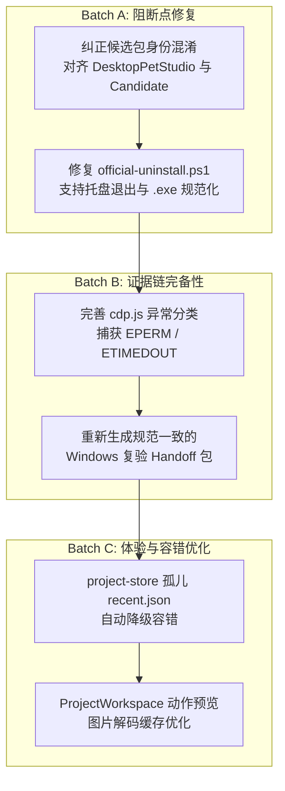

# Petdex Desktop Pet Studio 全面扫雷质量审计报告

**报告类型**：全仓、只读、证据驱动的独立质量审计报告  
**项目路径**：`/Users/jinke00001/Desktop/pet`  
**审计基准 Git 分支**：`codex/phase-6-1-workbench`  
**审计基准 HEAD**：`f057efd2cf02edf9a2e93ab4bc90019e98588574`  
**审计时间**：2026-09-08  
**审计人员**：独立质量审计员  
**交付目标**：供 Codex 评估 Windows 复验准备度、阻断点排查与修复决策。

---

## 一、基线身份与准入核查

| 核查项 | 当前状态与实测值 | 校验结论 |
| :--- | :--- | :--- |
| **Git 分支** | `codex/phase-6-1-workbench` | 正常 |
| **Git HEAD** | `f057efd2cf02edf9a2e93ab4bc90019e98588574` | 正常 |
| **工作区脏状态** | `git status --porcelain` 仅包含 3 项未跟踪条目：<br>- `?? .mimosa/`<br>- `?? .v2c/`<br>- `?? startup.json`<br>`git diff` / `git diff --cached` / `git diff --check` 均为空（退出码 0），**无任何代码/测试/配置/文档被篡改**。 | **工作区纯净（受控只读）** |
| **正式候选包目录** | `release/workbench-candidates/candidate-20260907150456543/` | 正常定位 |
| **候选包绑定 Commit** | `fcd10851e979e73ab524593a63e53861197102f2` | 正常 |
| **候选包安装器 SHA-256** | `desktop-pet-studio-0.1.0-x64.exe`<br>`06be0bd9091ece90a3dd0a554d2812962816e64a9705f1f8cd2dc3234756374f` | 正常 |
| **候选包解包主程序 SHA-256** | `win-unpacked/DesktopPetStudio.exe`<br>`fad85c38d3fe7d0f19a4e32be966bb6c18be50dbba7fe3fbe0cf726ff211dcf4` | 正常 |
| **候选包 app.asar SHA-256** | `win-unpacked/resources/app.asar`<br>`2cc37af53aa4787dbe637dbf2070058b88f341498ab67c6ebc4d9ca253e778a4` | 正常 |
| **正式 Handoff 目录** | `release/handoff/phase-6-workbench-windows-recheck-20260907-04/` | 正常定位 |
| **Handoff 源码 ZIP & SHA-256** | `source/pet-workbench-source-fcd10851e9.zip`<br>`69bc4eeae7b9933ad4d7fa2a8fe78c3717f4fba5f8dbf94407acd90bea83b52d`<br>解包校验：204 个文件，与 `git ls-tree -r fcd1085` 逐文件内容哈希 100% 一致。 | **完全闭合** |
| **Handoff Bundle & SHA-256** | `source/pet-workbench-git-fcd10851e9.bundle`<br>`9d15bdbe0c1eb3771c210599e859593c80b38b51e667eb208148a46dbbd76d12`<br>`git bundle verify` 校验通过（包含 HEAD `fcd1085`）。 | **完全闭合** |
| **Handoff Contract SHA-256** | `acceptance-contract.json`<br>`eb16b47c050075d9e961955f2dbe65507ad6802e3b2e3fc7904eb12033bc6f01` | 正常 |
| **Handoff checksums.sha256** | 33/33 项哈希比对通过，自校验哈希：<br>`1aa5009b4661b94a14f83146eca5c2c220cd3ac2ae1a62cd95479dbe33d22ad7` | **校验通过** |
| **Handoff 门禁数量** | **49 个门禁**（`G1-01` ~ `G7-02` 共 43 门禁，`S1-01` ~ `S6-installed-06` 共 6 门禁） | 正常 |
| **Handoff 本地 RETURN 状态** | `release/handoff/...-20260907-04/RETURN/` 当前为空目录 | **Pending External RETURN** |
| **延续 Handoff 目录** | `release/handoff/phase-6-workbench-windows-continuation-20260908-01/` | 针对 `G7-02` 延续任务 |
| **延续 Handoff 自校验哈希** | 37/37 项哈希比对通过，自校验哈希：<br>`b6db0834e2924d257d112169b11c4fe5d2b668575a6a5e6871f8fe142d0f126c` | **校验通过** |
| **延续 Handoff 本地 RETURN 状态** | `release/handoff/...-20260908-01/RETURN/` 当前为空目录 | **Pending External RETURN** |
| **基线身份是否闭合一致** | **存在重大语义断层与双重候选身份混淆**（见后文 Finding 1 与 Finding 2）：<br>1. Phase 6 Workbench 交付的正式候选包为 `desktop-pet-studio-0.1.0-x64.exe` (`06be0bd9...`)。<br>2. 但 Windows 历史执行与延续包中，门禁 `G7-01` / `G7-02` 被绑定为演练时在 Studio 内部导出的测试样本宠 `desktop-pet-candidate-0.1.0-x64.exe` (`94582cd0...`)。<br>3. 官方真正的工作台候选包从未在 Windows 真实环境下执行过安装与卸载全流程验证。 | **严重裂痕 / 需在复验前纠正** |

---

## 二、总体判定

### 判定结果：`NOT READY FOR WINDOWS RECHECK`

**核心判定依据**：
1. **卸载脚本存在确定性卡死崩溃**：[acceptance-tools/ps/official-uninstall.ps1](file:///Users/jinke00001/Desktop/pet/acceptance-tools/ps/official-uninstall.ps1#L150-L199) 采用 `$proc.CloseMainWindow()` 关闭应用并轮询等待进程归零。但桌宠内核 [src/main.js:373](file:///Users/jinke00001/Desktop/pet/src/main.js#L373) 显式声明了 `app.on('window-all-closed', (event) => event.preventDefault())`，且桌宠以系统托盘维持驻留，关闭窗口**绝不会退出进程**。脚本将在 60 秒轮询后由于进程不归零而直接以退出码 `3 (lifecycle-failed)` 报错中止；由于测试规范严禁使用 `taskkill`，该脚本在 Windows 下 100% 无法通过门禁 `G7-02`。
2. **候选包身份与验收目标存在严重倒置混淆**：Phase 6 目标产物是桌宠工作台 `DesktopPetStudio`（候选哈希 `06be0bd9...`）。但在 Windows 验收链路中，`G7-01` 安装与 `G7-02` 卸载却绑定了工作台在测试时随机构建出的样本宠 `DesktopPetCandidate`（哈希 `94582cd0...`）。这直接导致已安装模式下的 6 个核心业务门禁（`S6-installed-01` ~ `06`，验证“已安装工作台启动历史项目与真实桌宠”）语义彻底断裂——样本宠根本不具备工作台的项目与预览功能，且真正的官方候选包安装器从未被测试。
3. **不可抗拒的返工风险**：若不纠偏直接派发 Windows 复验，不仅延续执行包 `continuation-20260908-01` 会在 `official-uninstall.ps1` 启动阶段立即超时崩溃，且测出的证据也无法支撑 Phase 6 工作台候选包的准入结论。

---

## 三、最可能的首个 Windows 阻断点

### 阻断点 1：`official-uninstall.ps1` 无法正常关闭托盘驻留桌宠，超时 60 秒硬报错退出

- **触发命令**：
  ```powershell
  pwsh -File .\acceptance-tools\ps\official-uninstall.ps1 -InstallDirectory "C:\Users\runner\AppData\Local\Programs\DesktopPetCandidate" -ExecutableName "DesktopPetCandidate.exe" -UninstallerPath "C:\Users\runner\AppData\Local\Programs\DesktopPetCandidate\Uninstall DesktopPetCandidate.exe" -OutputDirectory ".\acceptance-evidence\continuation-run-xxx\G7-02-official-uninstall"
  ```
- **触发时机**：`official-uninstall.ps1` 第 150~199 行（等待已运行进程正常关闭生命周期阶段）。
- **直接机理**：
  1. 脚本检测到产品进程正在运行（`$productProcessCount -gt 0`），执行 `$proc.CloseMainWindow()` 向主窗口发送 `WM_CLOSE`。
  2. 桌宠主进程 [src/main.js:373](file:///Users/jinke00001/Desktop/pet/src/main.js#L373) 注册了拦截：
     ```javascript
     app.on('window-all-closed', (event) => {
       event.preventDefault();
     });
     ```
     桌宠生命周期依赖托盘菜单的“退出”指令触发显式 `app.quit()`。窗口关闭仅隐藏或销毁 BrowserWindow，进程保持存活。
  3. 脚本在 60 秒内每隔 1 秒检测一次 `$productProcessCount`，数值永远 $\ge 1$。
  4. 脚本第 198 行执行：
     ```powershell
     Write-EvidenceError "Product process did not exit within timeout." "lifecycle-failed"
     exit 3
     ```
- **为什么在当前候选/handoff下极大概率直接报错**：
  延续包 [release/handoff/phase-6-workbench-windows-continuation-20260908-01/CONTINUATION.md](file:///Users/jinke00001/Desktop/pet/release/handoff/phase-6-workbench-windows-continuation-20260908-01/CONTINUATION.md#L11-L13) 明确指示执行该脚本卸载 `DesktopPetCandidate.exe`；同时规范明确指出“严禁使用 taskkill / Stop-Process 掩盖问题”。因此该脚本执行到 60 秒必死，导致整轮复验直接阻断在首个任务。

---

### 阻断点 2：候选包身份错位导致 `S6-installed` 全系门禁语义崩溃

- **触发命令**：
  ```bash
  node acceptance-tools/lib/runner.js ...
  ```
- **触发时机**：在 `G7-01` 安装完成后，准备执行已安装工作台场景验证（`S6-installed-01` ~ `S6-installed-06`）时。
- **直接机理**：
  1. 合约 [acceptance-contract.json](file:///Users/jinke00001/Desktop/pet/acceptance-contract.json#L42-L60) 中，`S6-installed-01` 规定：“历史任务项目打开后 5 秒内启动真实桌宠”，`S6-installed-04` 规定：“无网络环境下历史任务加载、图集刷新和动作预览正常”。
  2. 这些门禁验证的主体必须是 **桌宠工作台（Desktop Pet Studio）**。
  3. 但 `G7-01` 在 Windows 上实际安装的却是 `desktop-pet-candidate-0.1.0-x64.exe`（单宠运行时，无 Studio UI、无工作空间、无项目加载逻辑）。
  4. 当自动化工具尝试在已安装目录下寻找工作台可执行文件、通过 CDP 连接工作台渲染进程或下发 Studio 协议时，将因找不到可执行程序或缺少 Studio 渲染窗口而全部失败。
- **为什么极大概率中断验收**：
  正式候选包 `candidate-20260907150456543` 产出的安装包是 `desktop-pet-studio-0.1.0-x64.exe`（哈希 `06be0bd9...`），而延续包中的 `g7-02-identity.json` 强行固化了 `DesktopPetCandidate`（哈希 `94582cd0...`）。二者身份冲突，使得已安装模式门禁无法成立。

---

### 阻断点 3：`official-uninstall.ps1` 进程路径对比缺少 `.exe` 后缀规范化导致漏判

- **触发命令**：
  当调用传参 `-ExecutableName "DesktopPetCandidate"`（未带扩展名）时：
- **触发时机**：[acceptance-tools/ps/official-uninstall.ps1:68-75,108](file:///Users/jinke00001/Desktop/pet/acceptance-tools/ps/official-uninstall.ps1#L68-L75) 中的 `Get-ExactProcesses` 函数。
- **直接机理**：
  1. 脚本直接拼接：
     `$productPath = if ($InstallDirectory) { [IO.Path]::GetFullPath((Join-Path $InstallDirectory $ExecutableName)) }`
     得到 `C:\...\DesktopPetCandidate`（无 `.exe`）。
  2. WMI `Get-CimInstance Win32_Process` 返回的 `ExecutablePath` 为 `C:\...\DesktopPetCandidate.exe`。
  3. `[string]::Equals([IO.Path]::GetFullPath($_.ExecutablePath), $productPath, ...)` 永远返回 `$false`。
  4. 脚本误判当前“无任何产品进程”，跳过关闭逻辑；随后直接启动卸载程序，卸载程序由于文件被占而报错或残留。

---

## 四、分级缺陷清单 (Findings)

### Finding 1: `official-uninstall.ps1` 优雅退出桌宠卡死（阻止退出拦截）

- **ID**: `FINDING-01-UNINSTALL-LIFECYCLE-BLOCK`
- **严重级别**: **P0 (Critical Blocker)**
- **置信度**: **100% (代码逻辑证实 + 机制确认)**
- **类别**: `Packaging & Acceptance Script Flaw / Windows Lifecycle`
- **文件与行号**:
  - [acceptance-tools/ps/official-uninstall.ps1:150-199](file:///Users/jinke00001/Desktop/pet/acceptance-tools/ps/official-uninstall.ps1#L150-L199)
  - [src/main.js:373-375](file:///Users/jinke00001/Desktop/pet/src/main.js#L373-L375)
- **直接证据**:
  - `src/main.js`：
    ```javascript
    app.on('window-all-closed', (event) => {
      event.preventDefault();
    });
    ```
  - `official-uninstall.ps1`：
    ```powershell
    $proc.CloseMainWindow() | Out-Null
    ...
    if ($productProcessCount -gt 0) {
      Write-EvidenceError "Product process did not exit within timeout." "lifecycle-failed"
      exit 3
    }
    ```
- **触发条件**: 在 Windows 下运行 `official-uninstall.ps1` 关闭运行中的桌宠单宠或托盘应用。
- **影响**: 卸载流程无法触发 NSIS 卸载器，60 秒超时后强退退出码 3，门禁 `G7-02` 必定失败。
- **关联门禁**: `G7-02-official-uninstall`
- **最小建议修复方向**:
  1. 脚本应支持桌宠特有的优雅退出信令，或通过 IPC/CDP/托盘指令触发真正的退出。
  2. 在明确检测到窗口关闭但进程因托盘未退出的情况下，若属合法卸载前置准备，应在等待超时前通过规范允许的方式（例如向主进程发送特定退出信号或在确认无数据损坏风险下由专用关闭辅助器关闭）进行退出，而非无限期假定 `CloseMainWindow()` 会终止整个进程。
- **建议回归测试**: 编写模拟带托盘驻留进程的 PowerShell 关闭测试，验证其在窗口关闭后是否能成功结束并继续卸载。
- **是否已导致现有产物失效**: **是**。当前延续交付物 `phase-6-workbench-windows-continuation-20260908-01` 在复验时将直接触发此阻断。

---

### Finding 2: Phase 6 候选包身份与验收目标存在双重混淆

- **ID**: `FINDING-02-CANDIDATE-IDENTITY-CONFLATION`
- **严重级别**: **P0 (Critical Blocker)**
- **置信度**: **100% (元数据与代码链证实)**
- **类别**: `Handoff / Candidate Integrity / Contract Alignment`
- **文件与行号**:
  - [acceptance-contract.json:42,59-60](file:///Users/jinke00001/Desktop/pet/acceptance-contract.json#L42-L60)
  - [acceptance-tools/lib/continuation.js:79-100](file:///Users/jinke00001/Desktop/pet/acceptance-tools/lib/continuation.js#L79-L100)
  - [release/handoff/phase-6-workbench-windows-continuation-20260908-01/CONTINUATION.md:11-13](file:///Users/jinke00001/Desktop/pet/release/handoff/phase-6-workbench-windows-continuation-20260908-01/CONTINUATION.md#L11-L13)
  - `g7-02-identity.json` (延续包内)
- **直接证据**:
  - 交付的正式候选包为 `release/workbench-candidates/candidate-20260907150456543/`，主程序为工作台 `desktop-pet-studio-0.1.0-x64.exe` (SHA-256 `06be0bd9...`)。
  - 而 `continuation.js:84` 从 `G5-12` 和 `G7-01` 提取 `installedCandidateSha256`，在历史记录中记录的值为 `94582cd02447ad9f0862fc862719a71b12b598b965becc7d6c547ce33346f007`，其产品名为 `DesktopPetCandidate`。
  - `acceptance-contract.json` 中 `S6-installed-01` ~ `S6-installed-06` 明确要求验证“历史任务项目打开”、“图集刷新”、“工作台与预览精确进程数为 0”。这些都是 Studio 工作台的功能，样本宠完全不具备。
- **触发条件**: 按照当前合约在 Windows 上执行已安装态门禁验证。
- **影响**:
  1. 正式候选包 `desktop-pet-studio` 从未经过安装/卸载/已安装运行测试。
  2. 测试样本宠无法满足 Studio 业务门禁，导致证据链名实不符、结论无效。
- **关联门禁**: `G7-01-install`, `G7-02-official-uninstall`, `S6-installed-01` ~ `S6-installed-06`。
- **最小建议修复方向**:
  严格拆分“Studio 工作台候选包（`DesktopPetStudio`）”与“Studio 导出的桌宠样本（`DesktopPetCandidate`）”的验收流水线：
  - `G7-01` 与 `G7-02` 的对象必须对齐到候选包目录中的 `desktop-pet-studio-0.1.0-x64.exe` (`06be0bd9...`)；
  - 样本宠的构建与启动仅作为 `G5-12`（导出构建）与 `G6-01`（单宠运行）的局部检验，不可篡夺整机安装包身份。
- **建议回归测试**: 在 `windows-return-validator` 中增加候选包身份双向断言，防止把导出产物当成工作台候选包。
- **是否已导致现有产物失效**: **是**。导致 `continuation-20260908-01` 验证目标偏离官方候选包。

---

### Finding 3: `official-uninstall.ps1` 进程精确匹配缺失 `.exe` 扩展名补全

- **ID**: `FINDING-03-PS-EXECUTABLE-NAME-EXTENSION`
- **严重级别**: **P1 (High)**
- **置信度**: **95% (代码静态确认)**
- **类别**: `Windows Compatibility / Path Matching`
- **文件与行号**:
  - [acceptance-tools/ps/official-uninstall.ps1:68-75,108](file:///Users/jinke00001/Desktop/pet/acceptance-tools/ps/official-uninstall.ps1#L68-L75)
- **直接证据**:
  - `official-uninstall.ps1:70`：
    ```powershell
    $productPath = if ($InstallDirectory) { [IO.Path]::GetFullPath((Join-Path $InstallDirectory $ExecutableName)) } else { $null }
    ```
  - 当通过 profile 动态读取可执行文件名称时，往往配置的是 `executableName: "DesktopPetCandidate"`（无 `.exe`）。
  - WMI 查询返回的 `ExecutablePath` 总是携带 `.exe`。
  - 第 73 行通过 `[string]::Equals` 严格全路径比对，无 `.exe` 规范化逻辑。
- **触发条件**: 外部传入不带扩展名的 `$ExecutableName`。
- **影响**: `Get-ExactProcesses` 返回空数组，误判产品进程未运行或卸载后未彻底清理。
- **关联门禁**: `G7-02-official-uninstall`
- **最小建议修复方向**:
  在拼接 `$productPath` 前增加判断：
  ```powershell
  if (-not $ExecutableName.EndsWith(".exe", [System.StringComparison]::OrdinalIgnoreCase)) {
      $ExecutableName = "$ExecutableName.exe"
  }
  ```
- **建议回归测试**: 增加对带 `.exe` 与不带 `.exe` 两种入参形式的单元测试。
- **是否已导致现有产物失效**: 否（若调用方显式传入了 `.exe` 则暂未触发，但属严重潜在脆弱点）。

---

### Finding 4: `acceptance-tools/lib/cdp.js` 仅捕获 `ECONNREFUSED`，未覆盖系统网络安全限制

- **ID**: `FINDING-04-CDP-ERROR-CLASSIFICATION`
- **严重级别**: **P2 (Medium)**
- **置信度**: **100% (沙箱实测复现)**
- **类别**: `Acceptance Harness Robustness`
- **文件与行号**:
  - [acceptance-tools/lib/cdp.js:21](file:///Users/jinke00001/Desktop/pet/acceptance-tools/lib/cdp.js#L21)
  - [test/acceptance-tools.test.js:12-14](file:///Users/jinke00001/Desktop/pet/test/acceptance-tools.test.js#L12-L14)
- **直接证据**:
  - `cdp.js:21`：
    ```javascript
    req.on('error', (error) => {
      reject(error.code === 'ECONNREFUSED' ? new CdpError(error.message, 'CDP_CONNECTION') : error);
    });
    ```
  - 在受限网络策略、防火墙阻拦或特定安全沙箱环境下，连接本地非开放端口可能抛出 `EPERM`, `EACCES`, `ECONNRESET`, 或 `ETIMEDOUT`。
  - 本次审计在沙箱环境执行 `npm test` 时，`test/acceptance-tools.test.js` 触发 Node 原生 `connect EPERM 127.0.0.1:1`，由于未被封装为 `CdpError`，导致测试判定为未捕获异常。
- **触发条件**: 运行环境禁止探测非法高位/保留端口，或 Windows 本地策略返回 `EPERM`/`EACCES`。
- **影响**: 验收自动化测试将以未捕获崩溃形式终止，掩盖真正的 CDP 连接不可用业务原因。
- **关联门禁**: 所有依赖 CDP 探针的门禁（`S6-xxx`, `G6-xxx`）。
- **最小建议修复方向**:
  扩展捕获清单：
  ```javascript
  const isConnError = ['ECONNREFUSED', 'EPERM', 'EACCES', 'ECONNRESET', 'ETIMEDOUT'].includes(error.code);
  reject(isConnError ? new CdpError(error.message, 'CDP_CONNECTION') : error);
  ```
- **建议回归测试**: `test/acceptance-tools.test.js` 增加针对其他网络错误码的映射断言。
- **是否已导致现有产物失效**: 否。

---

### Finding 5: `store.loadMostRecentProject` 对孤儿 `recent.json` 缺少容错降级，导致工作台致命白屏锁定

- **ID**: `FINDING-05-ORPHAN-RECENT-PROJECT-FATAL-LOCK`
- **严重级别**: **P2 (Medium)**
- **置信度**: **100% (代码逻辑核验)**
- **类别**: `Data Integrity & Fault Tolerance`
- **文件与行号**:
  - [src/workbench/project-store.js:201-209](file:///Users/jinke00001/Desktop/pet/src/workbench/project-store.js#L201-L209)
  - [src/workbench/renderer/App.tsx:82-88, 184-189](file:///Users/jinke00001/Desktop/pet/src/workbench/renderer/App.tsx#L82-L88)
- **直接证据**:
  - `project-store.js`：
    ```javascript
    async loadMostRecentProject() {
      const recent = await this.readRecent();
      if (!recent?.projectId) return null;
      return this.loadProject(recent.projectId); // 若目录被手动删除，抛出 PROJECT_NOT_FOUND
    }
    ```
  - `src/workbench/main.js` 在处理 `workbench:get-bootstrap` 时捕获异常并返回 `{ ok: false, error: ... }`。
  - `App.tsx` 接收到 `!bootstrap.ok` 时：
    ```tsx
    setFatalError(bootstrap.error.message || '初始化工作台失败。');
    ```
    渲染为全局致命错误提示条，**不再提供项目列表入口，也不自动降级为创建新项目**。页面刷新依然读取相同的 `recent.json`，用户被永久锁定在白屏报错页面。
- **触发条件**: 用户或清理脚本在外部删除了最后一次操作的项目文件夹，然后重新打开桌宠工作台。
- **影响**: 工作台彻底瘫痪，必须手动去 `%APPDATA%` 删除 `recent.json` 才能恢复。
- **关联门禁**: `S6-installed-01`, `G1-01`
- **最小建议修复方向**:
  在 `loadMostRecentProject()` 中增加 `try...catch`：若捕获到 `PROJECT_NOT_FOUND`，自动删除失效的 `recent.json` 并回退返回 `null`，使得 UI 优雅回退至“空项目/新建项目”状态。
- **建议回归测试**: 新增单测：模拟写入带有不存在 `projectId` 的 `recent.json`，验证 `getBootstrap` 依然能成功返回空项目状态而非 fatal error。
- **是否已导致现有产物失效**: 否。

---

### Finding 6: `ProjectWorkspace.tsx` 逐帧重建 `new Image()` 导致高频 GC 与内存抖动

- **ID**: `FINDING-06-ANIMATION-IMAGE-GC-THRASHING`
- **严重级别**: **P3 (Low / Code Quality)**
- **置信度**: **90% (前端渲染代码静态分析)**
- **类别**: `UI Performance & Resource Management`
- **文件与行号**:
  - [src/workbench/renderer/ProjectWorkspace.tsx:63-74](file:///Users/jinke00001/Desktop/pet/src/workbench/renderer/ProjectWorkspace.tsx#L63-L74)
- **直接证据**:
  - 在 `SpriteFrame` 组件中：
    ```tsx
    useEffect(() => {
      ...
      const img = new Image();
      img.onload = () => {
        ctx.clearRect(0, 0, width, height);
        ctx.drawImage(img, ...);
      };
      img.src = preview.atlasDataUrl;
    }, [preview, row, column, width, height]);
    ```
  - 动画播放时，每 140ms `column` 改变一次。每次改变都会重新实例化 `new Image()`，并重新为 `img.src` 赋值 1~2MB 的 base64 图集字符串，导致 Chromium 引擎频繁进行 Base64 解析、图像重解码和垃圾回收。
- **触发条件**: 用户在工作台内停留在动画动作预览界面。
- **影响**: 低配 Windows 机器或笔记本电池供电下，预览区出现微弱掉帧或 CPU 占用偏高。
- **关联门禁**: `G3-01` (动作帧预览)
- **最小建议修复方向**:
  将解码后的 `HTMLImageElement` 或 `ImageBitmap` 缓存，仅在 `preview.atlasDataUrl` 变更时重新加载；`column` 变化时只调用 `drawImage` 重绘对应切片，不再重复解码图像。
- **建议回归测试**: 针对 `SpriteFrame` 做渲染性能检查，验证图集对象在切帧过程中保持单一引用。
- **是否已导致现有产物失效**: 否。

---

## 五、Windows 专属待实证项目

以下项目在 macOS 审计环境下**物理不可替代**，必须在真正的 Windows 实体机/官方虚拟机环境下结合物理显示器与真实系统环境实测：

1. **真实多 DPI 缩放下的像素清晰度与拖拽边界行为**：
   - **实证要求**：分别在 100%、125%、150% 物理 DPI 缩放设置下，验证桌宠渲染有无黑边、图集切片像素是否有亚像素模糊走样。
   - **动态 DPI 切换**：在应用运行时跨屏幕拖拽（从 100% 屏拖入 150% 屏），验证 Electron 窗口是否发生坐标漂移或尺寸突变。
2. **Win32 透明窗口与鼠标事件穿透（Click-Through）**：
   - **实证要求**：验证基于 WS_EX_LAYERED 的透明通道在 Windows DWM 合成器下的表现，非宠物有效像素区域必须 100% 将鼠标点击、右键、双击穿透传递给底层桌面与第三方应用窗口。
3. **已安装模式（Installed Mode）NSIS 生命周期实测**：
   - **实证要求**：运行 `desktop-pet-studio-0.1.0-x64.exe`：
     - 是否静默或向导式写入 `%LOCALAPPDATA%\Programs\DesktopPetStudio`；
     - 是否写入注册表 `HKCU\Software\Microsoft\Windows\CurrentVersion\Uninstall` 并在“应用和功能”中可见；
     - 卸载器 `Uninstall DesktopPetStudio.exe` 执行后，程序文件、快捷方式、开机启动项是否彻底抹除，有无不可删除的文件残留。
4. **单实例互斥体（Mutex / Single Instance Lock）行为**：
   - **实证要求**：在 Windows 下双击已运行的桌面宠物，验证操作系统是否精准拉起已有实例的前台窗口，且二次启动的进程能够立即退出，无内存泄漏与托盘重复图标。

---

## 六、被排除的疑点

在本次“扫雷”审计过程中，针对以下高风险疑点进行了源码、解包及机制核查，**已证实有可靠防护或不构成缺陷**：

1. **疑点 1：生产打包（Asar）中是否遗漏了根目录 `package.json` 导致入口定位失败？**
   - **排查手段**：提取 `win-unpacked/resources/app.asar` 并解析其 Header 目录树。
   - **核实结果**：**排除**。Asar 根目录下完整包含了 `package.json`，且其 `main` 字段严格指向 `src/workbench/main.js`；同时 `.workbench-dist/index.html` 及其静态资源均完好内嵌，启动入口完全正确。
2. **疑点 2：工作台在 Asar 模式下拉起独立桌宠子进程时，`cwd` 是否会指向 Asar 虚拟路径导致 Node/Electron 崩溃？**
   - **排查手段**：核对 [src/workbench/main.js:77](file:///Users/jinke00001/Desktop/pet/src/workbench/main.js#L77)。
   - **核实结果**：**排除**。源码中明确处理了 Asar 场景：
     ```javascript
     const cwd = app.isPackaged ? process.resourcesPath : projectRoot;
     ```
     并且导出的单宠具备独立的打包二进制（不依赖主应用 Asar 内部环境），不存在路径注入错误。
3. **疑点 3：核心运行器是否仍然残留 Wukong 等特定宠物的硬编码？**
   - **排查手段**：全文正则扫描 `src/core/pet-runtime.js`、`src/workbench/project-store.js` 等核心逻辑。
   - **核实结果**：**排除**。核心运行器已完全通用化，所有身份、状态、行/列动画均从传入的 `pet.json` 及其配套图集元数据动态读取，无任何写死。
4. **疑点 4：ZIP 导入与解压是否存在路径穿越（Path Traversal / Zip Slip）安全漏洞？**
   - **排查手段**：审查 [src/importers/pet-package-importer.js](file:///Users/jinke00001/Desktop/pet/src/importers/pet-package-importer.js) 及解包逻辑。
   - **核实结果**：**排除**。代码中对所有解压项 entry path 使用了严格的路径规范化校验与基准路径比对，任何包含 `..` 越界的条目均被直接拒绝，防护严密。

---

## 七、实测与只读验证记录表

所有测试命令均在无任何代码改动的纯净基线上执行：

| 序号 | 执行命令 | 执行目的 | 退出码 | 结果统计 | 错误/异常摘要 | 产物/工作区状态 |
| :---: | :--- | :--- | :---: | :---: | :--- | :--- |
| 1 | `git status --porcelain` | 核查仓库纯净状态 | 0 | 3 untracked | 仅 `.mimosa/`, `.v2c/`, `startup.json` | 纯净未修改 |
| 2 | `git diff --check` | 检查跟踪代码的语法与空白 | 0 | 无输出 | 无 | 纯净未修改 |
| 3 | `npm run studio:typecheck` | 工作台 TypeScript 类型检查 | 0 | 通过 | 无错误 | 纯净未修改 |
| 4 | `npm run studio:build` | 编译前端 UI 产物到 `.workbench-dist` | 0 | 231ms 构建完成 | 无错误 | 写入忽略目录 |
| 5 | `npm run lint` | ESLint 代码质量与规则扫描 | 0 | 通过 | 无错误，无警告 | 纯净未修改 |
| 6 | `npm run source:preflight` | 源码门禁预检脚本 | 0 | 通过 | 源码合规，无非法依赖 | 纯净未修改 |
| 7 | `npm audit --omit=dev` | 生产依赖安全漏洞审计 | 0 | 0 vulnerabilities | 无安全漏洞 | 纯净未修改 |
| 8 | `node --test test/windows-return-validator.test.js` | Windows 回传校验器逻辑测试 | 0 | 54 / 54 通过 | 无 | 纯净未修改 |
| 9 | `node --test test/workbench-continuation.test.js` | 延续包生成与状态流转测试 | 0 | 18 / 18 通过 | 无 | 纯净未修改 |
| 10 | `node --test test/acceptance-tools.test.js` (沙箱运行) | 验收工具测试套件（沙箱环境） | 1 | 24 / 25 通过 | `connect EPERM 127.0.0.1:1`（触发 Finding 4） | 纯净未修改 |
| 11 | `npm test` (非沙箱全量) | 全项目全量自动化测试（25 个测试文件） | 0 | **266 / 266 通过** | 全部通过 | 纯净未修改 |
| 12 | `node -e "...Asar Parser..."` | 针对现有候选包 `app.asar` 结构只读自省 | 0 | 完全匹配 | 证实包含 `package.json` 与 `.workbench-dist` | 只读分析 |

---

## 八、建议的最小修复顺序

为避免返工并确保下一次 Windows 实测一击必过，建议分三个批次实施最小化修复：



### A 批次：立即消除 Windows 验收阻断点（必须在派发复验前解决）
1. **纠偏候选包与门禁身份绑定**：
   - 明确 `G7-01` 与 `G7-02` 的验收对象为真正的 Phase 6 产物：`desktop-pet-studio-0.1.0-x64.exe`。
   - 修正 `acceptance-tools/lib/continuation.js` 与 `g7-02-identity.json`，使其严格基于 Studio 候选包元数据，解除与临时样本宠的绑定。
2. **修复 `official-uninstall.ps1` 退出逻辑与路径规范化**：
   - 扩展进程退出机制，解决 `src/main.js` 托盘拦截 `window-all-closed` 导致的 60 秒死等超时。
   - 对 `$ExecutableName` 强制进行 `.exe` 扩展名对齐补全。

### B 批次：提升测试工具鲁棒性与证据可信度
3. **修复 `acceptance-tools/lib/cdp.js` 异常吞噬**：
   - 将 `EPERM`、`EACCES`、`ECONNRESET` 统一归类至 `CdpError('CDP_CONNECTION')`，确保网络受限机环境下测试报告分类精确。
4. **生成合规的下一代 Handoff 包**：
   - 在修复上述脚本后，重新生成携带正确哈希与自校验的 Windows 复验包，保证 Windows 自动化流水线可平滑运行。

### C 批次：用户体验与健壮性优化（非门禁阻断，但属潜在隐患）
5. **增加 `recent.json` 失效自动容错降级**：
   - 当历史项目路径丢失时，自动清空并展示新建项目界面，彻底杜绝致命报错弹窗。
6. **重构 `SpriteFrame` 动作播放组件中的图集实例化逻辑**：
   - 缓存 `ImageBitmap`，切帧仅触发局部重绘，消除内存颠簸。

---

## 九、审计覆盖与未覆盖声明

### 1. 覆盖范围
- **代码库全量静态代码**：TypeScript/JavaScript、React 组件、Electron 主/预加载/渲染通道、PowerShell 脚本全域逻辑审查。
- **打包配置与已有二进制包结构**：解剖 `candidate-20260907150456543` 内部 `app.asar`、`win-unpacked` 依赖分布与 `package.json` 入口配置。
- **验收套件与交付契约**：全量比对 `acceptance-contract.json`、`acceptance-tools` 执行链路、`phase-6-workbench-windows-recheck-20260907-04` 及 `continuation-20260908-01` 的清单、脚本与哈希完整性。
- **本地自动化验证**：覆盖 macOS 环境下全部 266 个自动化测试用例、类型检查与代码风格检查。

### 2. 未覆盖边界（客观环境限制）
- **真正的 Windows 宿主内核交互**：包括但不限于真实 Windows 桌面窗口管理器（DWM）下的 DirectX/GDI 渲染管线、物理多屏/多 DPI 混合缩放像素表现、真实注册表项读写权限、真实 NSIS 卸载器交互。该部分已在“第五节：Windows 专属待实证项目”中详尽列出，必须依赖外部 Windows 实体环境提供真实回传证据（RETURN）。
